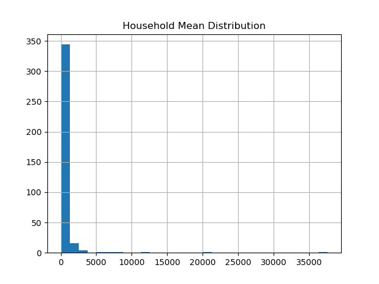
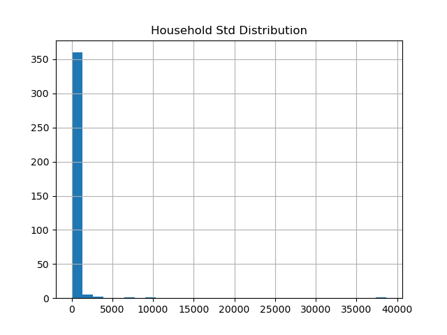
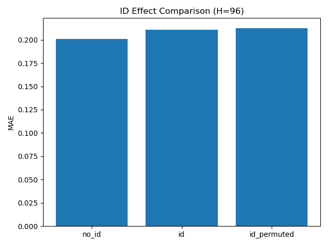
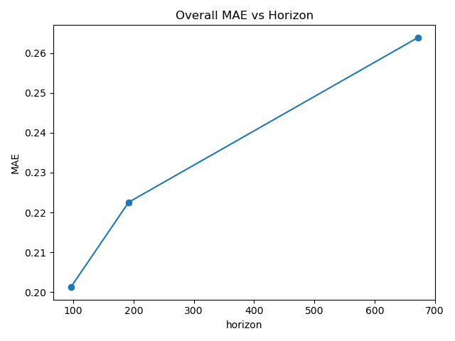
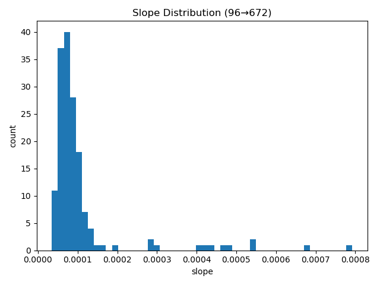
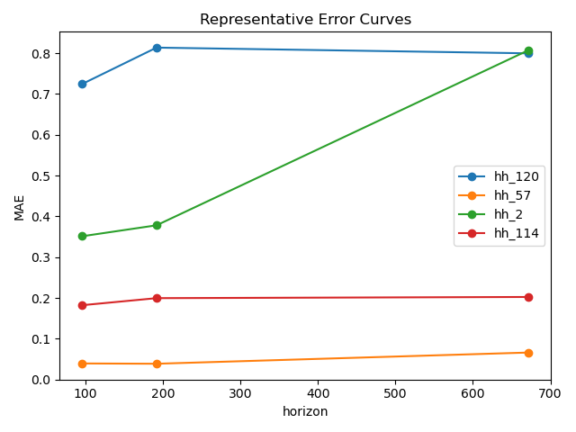
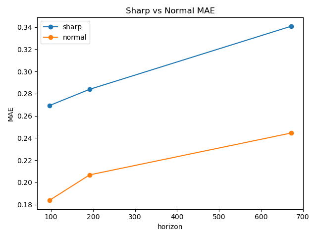
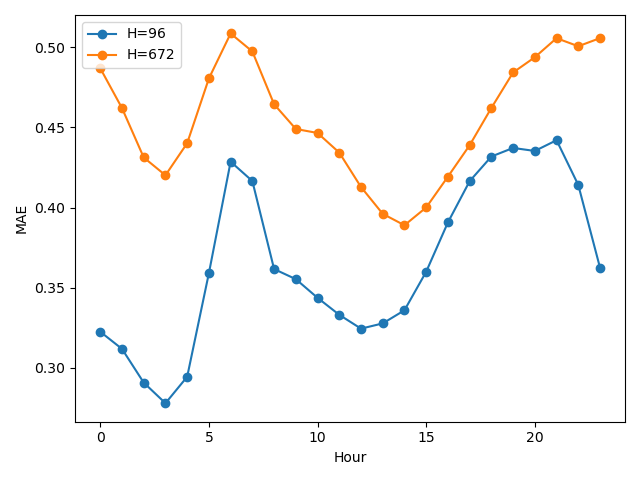

# Structural Limitation Analysis of Encoder-only Transformer in Long-Horizon Electricity Forecasting

본 프로젝트는 Multi-household 전력 시계열 데이터를 기반으로  
**Encoder-only Transformer 구조가 장기 Horizon 확장 상황에서 어떤 구조적 한계를 보이는지 체계적으로 분석**하는 연구이다.

단순 성능 비교가 아니라,

- Horizon 증가에 따른 평균 성능 변화
- Household별 성능 악화의 비균질성
- 급격한 변화 구간에 대한 민감도
- 시간대별 패턴 취약성

을 단계적으로 분석하여 구조적 한계를 규명하는 데 초점을 둔다.

---

# 1. Motivation

Encoder-only Transformer는 self-attention을 통해
전체 시계열 정보를 통합하고,
마지막 토큰 representation을 출력에 사용하여
미래 horizon 전체를 예측한다.

이 구조는 다음과 같은 질문을 남긴다.

- Horizon이 길어질수록 정보 압축의 한계가 발생하는가?
- 성능 저하는 모든 시계열에 동일하게 나타나는가?
- 특정 데이터 구조에서 더 취약해지는가?

본 연구는 이러한 질문을 실험적으로 검증한다.

---

# 2. Dataset

- Electricity Load Diagrams 2011–2014
- 15-minute interval
- Multi-household consumption data

각 "household"는 데이터셋의 한 column에 해당하며, 
개별 전력 소비 주체(가구 또는 고객 단위)를 의미한다.

본 연구에서는 각 household를 하나의 독립적인 시계열 구조 단위로 간주하여 
장기 예측 취약성을 비교 분석한다.

### Split

- Train: 2011–2012
- Validation: 2013
- Test: 2014

### Preprocessing

- 2011년 전체 기간 동안 소비 기록이 전혀 없는 household 제거
- Per-household z-score normalization
- Sliding window 기반 샘플 구성

---

# 3. Baseline Model

## Encoder-only Transformer

- Value Embedding
- Learnable Positional Encoding
- Multi-layer Transformer Encoder
- Linear Head (last_token output)

### Training Setup

- Loss: MSE
- Optimizer: AdamW
- Scheduler: ReduceLROnPlateau
- EarlyStopping 적용

---

# 4. ID Embedding Verification

EDA 결과를 바탕으로 ID embedding의 필요 여부를 먼저 검토하였다.

<p align="center">
  
  
</p>

Household 간 평균 및 분산 차이는 일부 존재하지만,
per-household z-score normalization을 적용하였기 때문에
scale 차이는 대부분 제거된 상태이다.

<p align="center">
  
</p>

일별 소비 패턴은 전반적으로 유사한 주기성을 공유하나,
완전히 동일하지는 않다.

→ household 간 차이는 존재하지만,
ID embedding이 반드시 필요하다고 단정하기는 어려운 상황이었다.

따라서 이를 가정하지 않고 실험적으로 검증하였다.

---

## ID vs No-ID 비교 (H=96)

<p align="center">
  
</p>

비교 결과, ID embedding은 no_id baseline 대비 성능 개선을 보이지 않았으며,
일부 지표에서는 오히려 낮은 성능을 기록하였다.

이는 household ID 정보가 일반화에 실질적인 도움이 되지 않았음을 의미하며,
불필요한 모델 자유도 증가로 이어졌을 가능성이 있다.

이후 분석은 no_id baseline 기준으로 진행하였다.

---

# 5. Horizon Increase Analysis

본 섹션에서는 예측 길이(Horizon)가 증가할 때
성능 저하가 어떤 구조로 나타나는지를 단계적으로 분석한다.
단순히 평균 MAE의 증가를 확인하는 데 그치지 않고,
household 수준에서의 이질성과 그 구조적 원인을 함께 분석한다.

---

## 5.1 Overall Performance Degradation

Test 기준 전체 평균 MAE는 다음과 같이 증가하였다.

- H = 96   → 0.201291918754577  
- H = 192  → 0.222584769129753  
- H = 672  → 0.263861119747161  

예측 길이가 증가할수록 평균 MAE는 일관되게 상승한다.
96에서 672로 확장될 때 약 31% 수준의 상대적 증가가 나타났다.

이는 장기 예측에서 입력 정보를 단일 집약 표현에 의존하는 출력 구조의 한계를 시사한다.

<p align="center">
  
</p>

그러나 평균 값만으로는 성능 저하의 구조를 충분히 설명할 수 없다.
다음 단계에서는 household 수준의 이질성을 분석한다.

---

## 5.2 Household-level Error Growth

각 household에 대해 Horizon 증가에 따른 MAE 증가율(slope)을 계산하였다.

Slope는 다음과 같이 정의된다.

> Horizon이 1 step 증가할 때 해당 household의 MAE 증가량

계산 결과는 다음과 같다.

- slope_mean = 0.0001086  
- slope_std  = 0.0001138  
- slope_min  = 0.000035  
- slope_max  = 0.000792  

표준편차가 평균보다 크다는 점은
Horizon 증가에 따른 성능 저하가 household마다 크게 다름을 의미한다.

일부 household는 거의 영향을 받지 않지만,
일부는 평균 대비 약 7배 이상 높은 증가율을 보였다.

<p align="center">
  
</p>

Slope 분포는 낮은 값에 밀집되어 있으나,
오른쪽으로 긴 꼬리를 가진다.
즉, 소수 household가 평균 성능 저하를 크게 끌어올리는 구조이다.

이는 장기 예측 성능 저하가 단순 난이도 증가가 아니라
비균질적 구조적 취약성에서 비롯될 가능성을 보여준다.

---

## 5.3 Structural Characteristics of Vulnerable Households

Slope 기준 상위 20개 household(취약 그룹)와
하위 20개 household(안정 그룹)를 비교하였다.

결과는 다음과 같다.

- variance_top20 = 1.1936  
- variance_bottom20 = 0.6882  

- sharpness_top20 = 0.1806  
- sharpness_bottom20 = 0.1548  

- autocorr_top20 = 0.8076  
- autocorr_bottom20 = 0.9254  

해석은 다음과 같다.

1. 변동성(variance)이 높은 household일수록 장기 예측에서 더 크게 무너진다.  
2. 급격한 변화(sharpness)가 많은 household에서 성능 저하가 두드러진다.  
3. 자기상관(autocorrelation)이 낮은 household일수록 장기 예측 취약성이 높다.

즉, 장기 예측에 취약한 household는  
변동성이 크고, 급변 구간이 많으며, 반복성이 낮다는 공통 특성을 가진다.

---

## 5.4 Representative Degradation Patterns

<p align="center">
  
</p>

대표 household들의 MAE 증가 곡선을 시각화하면 다음과 같은 패턴이 관찰된다.

- 일부는 거의 선형적으로 증가
- 일부는 특정 구간에서 급격히 상승
- 일부는 초기부터 높은 오차 유지

이는 Horizon 증가에 따른 성능 저하가
household별로 서로 다른 방식으로 나타남을 보여준다.

---

# 6. Sharp Transition Analysis

장기 예측 취약성이 급격한 변화 구간과 연결되는지 확인하기 위해
sharp transition 분석을 수행하였다.

---

## 6.1 Sharp vs Normal Segment Error

소비 변화량(Δy)을 기준으로 급변 구간을 정의하고,
해당 구간과 일반 구간의 평균 MAE를 비교하였다.

<p align="center">
  
</p>

결과는 다음과 같다.

H = 96  
- MAE_sharp  = 0.2692  
- MAE_normal = 0.1838  

H = 192  
- MAE_sharp  = 0.2839  
- MAE_normal = 0.2068  

H = 672  
- MAE_sharp  = 0.3408  
- MAE_normal = 0.2445  

모든 Horizon에서 급변 구간의 오차가 일반 구간보다 크게 나타났다.

이는 모델이 급격한 변화 패턴을 일관되게 더 어려워함을 의미한다.

---

## 6.2 Sharp Penalty

Sharp penalty는 다음과 같이 계산하였다.

- 96  → 0.0855  
- 192 → 0.0772  
- 672 → 0.0963  

장기 Horizon(H=672)에서 sharp penalty가 가장 크게 나타났다.

이는 예측 길이가 길어질수록
급격한 변화에 대한 모델의 취약성이 다시 확대되는 경향을 시사한다.

---

# 7. Time-of-Day Vulnerability Analysis

마지막으로 하루 중 시간대별 취약성을 분석하였다.

---

## 7.1 Hourly MAE Pattern

<p align="center">
  
</p>

96과 672 Horizon 모두
오차 패턴은 하루 소비 패턴의 진폭과 유사한 구조를 보인다.

- 소비가 높은 시간대에서 오차가 증가
- Horizon 증가로 패턴 자체가 왜곡되지는 않음

시간대에 따른 난이도 차이는 모든 Horizon에서 존재했다.
그러나 Horizon 증가에 따른 성능 저하가 특정 시간대에 집중되지는 않았다.

---

## 7.2 Peak vs Non-Peak Comparison

H = 96  
- peak_mae      = 805.40  
- non_peak_mae  = 611.62  
- diff          = 193.78  

H = 672  
- peak_mae      = 807.85  
- non_peak_mae  = 613.58  
- diff          = 194.27  

모델은 모든 Horizon에서
피크 시간대에서 약 194 수준 더 높은 오차를 보였다.

그러나 Horizon 증가가 피크-비피크 격차를 확대시키지는 않았다.

따라서 시간대 요인은 기본 난이도 구조이며,
장기 예측 성능 악화의 핵심 설명 변수는 아니다.

---

# 8. Final Conclusion

본 연구는 장기 예측 성능 저하의 원인을 단계적으로 분석하였다.

1. Horizon이 증가할수록 평균 MAE는 지속적으로 증가한다.
2. 그러나 성능 저하는 household별로 매우 비균질적으로 나타난다.
3. 장기 예측에 취약한 household는:
   - 높은 변동성
   - 많은 급변 구간
   - 낮은 자기상관
   의 공통 특성을 가진다.
4. 급변 구간은 모든 Horizon에서 추가 오차를 유발하며,
   장기 예측에서 그 영향이 더욱 확대된다.
5. 피크 시간대는 모든 Horizon에서 일관되게 높은 오차를 보였지만,
   Horizon이 증가한다고 해서 피크 시간대의 오차 격차가 특별히 확대되지는 않았다.

결과적으로, 장기 예측 성능 저하는 단순한 예측 거리 증가의 문제가 아니라,
데이터 구조의 비균질성과 급격한 변화에 대한 모델 표현 한계와 밀접하게 연결되어 있다.

---

# 9. Project Structure

```
.
├── assets/ # 모든 시각화 결과 (EDA / 구조 분석 / ID 비교)
│ ├── eda/
│ ├── analysis/
│ └── id_embedding/
│
├── analysis/ # 구조적 취약성 분석 스크립트
│ ├── horizon_analysis.py
│ ├── sharp_transition_analysis.py
│ ├── time_of_day_analysis.py
│ └── id_effect_analysis.py
│
├── model_results/ # Horizon별 예측 로그 및 결과 (분석 입력 데이터)
│
├── src/ # 모델 및 학습 파이프라인
│
├── train.py # 모델 학습 실행
├── test.py # 테스트 및 예측 결과 저장
├── eda_pattern.py # 시계열 패턴 EDA
├── eda_structure.py # 통계적 구조 EDA
│
├── requirements.txt
├── README.md
├── LICENSE
└── .gitignore
```